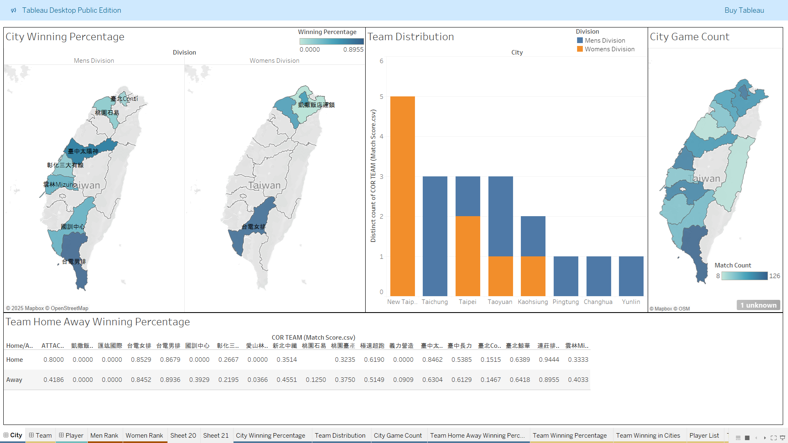
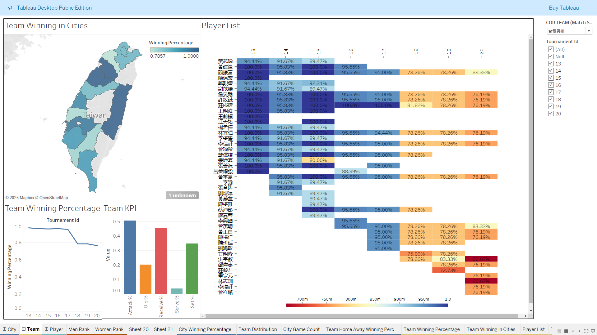
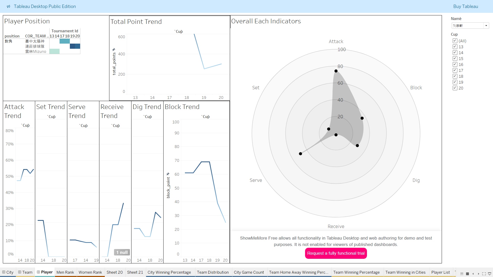

# Volleyball League Data Scraping & Analytics System

  

Top Volleyball League (TVL) is one of the highest level volleyball league in Taiwan. Starting from 2004, it has successfully promoted the sport and increasingly attracted more spectators. This project aims to provide players' insights the in the league and offer recommendation for the Chinese Taipei Volleyball Association or other stakeholders, such as overseas team managers. It identifies potential national team candidates and highlights talented players suitable for recruitment as valuable assets.

This project is a personal side project developed using modern technology stacks and methodologies, including **FastAPI** for API development, **Celery** and **RabbitMQ** for asynchronous task management, and Docker for efficient deployment. The data is sourced from TVL's publicly available datasets, covering the seasons from tournament 13 to 20. Moreover, it employer machine learning (ML) techniques to analyze player performance and predict potential outcomes, while Tableau Public provides visual analytics for data interpretation.

## Project Overview

The Volleyball League Data Scraper consists of two main modules:

- API: Built with FastAPI, handles database interactions and provides endpoints to access scraped data.
- Crawler: Performs web scraping tasks, extracting data from public volleyball league websites.
- ML models: Predicts player performance
- Tableau: Visualizing data






## Tech Stack

- **pyenv** & **Poetry**: Python environment and dependency management
- **Python**: BeautifulSoup, requests, pandas, sqlalchemy, pydantic ...
- **MySQL**: Structured data storage
- **Celery** & **RabbitMQ**: Distributed scraping tasks
- **Docker** & **Docker Swarm** Containerization and orchestration
- **Portainer**: Managing Docker Swarm
- **pytest** & **coverage**: Unit testing
- **Github**: Original version control and code management
- **GitLab**: Continuous integration and deployment (CI/CD)
- **Tableau Public**: Data visualization

## Directory Structure

```
Volleyball-League-Data-Scraping-Analytics-System
├── api
│   ├── main.py                 # API entry point
│   └── Dockerfile              # Docker configurations for api
├── volleyballdata
│   ├── crawler                 # Web scraping scripts
│   ├── database                # Database setup and interactions
│   ├── etl
│   │   └── etl.py              # Data ETL processes
|   ├── schema                  # Data format verifications
|   ├── tasks                   # Asynchronous task management
│   └── sql
│       └── CreateTableRaw.sql  # SQL code for creating tables for data scraping
├── ml
│   ├── data_prepare
│   │   └── prepare.py          # ML data preparation
│   ├── model                   # ML models
|   ├── training                # ML models training scripts
|   └── recommendation.py       # Main prediction scripts
├── bi
│   └── radar.py                # BI data preparation for radar chart
├── ETL_files                   # Output files from ETL processes
├── tests                       # Test cases
├── Dockerfile                  # Docker configurations for crawler
├── api.yml                     # Docker compose file for api
├── crawler.yml                 # Docker compose file for crawler
├── mysql.yml                   # Docker compose file for database
├── portainer.yml               # Docker compose file for portainer
├── produce.py                  # Asynchronously sends tasks to different queues
└── README.md                   # Project documentation
```

## Installation

1. Clone the repository:

```bash
git clone https://github.com/HHsieh09/Volleyball-League-Data-Scraping-Analytics-System.git
cd Volleyball-League-Data-Scraping-Analytics-System
```

2. Set up Python environment using `pyenv` and `poetry`:

```bash
pyenv install 3.9.21
pyenv local 3.9.21
poetry install
```

3. Initialize Docker Swarm and deploy using Portainer:

```bash
docker swarm init
docker stack deploy -c docker-compose.yml volleyball
```

## Usage

### API

Start the FastAPI service:

```bash
uvicorn api.main:app --host 0.0.0.0 --port 8888
```

### Crawler

Run web scraping tasks:

```bash
python -m volleyballdata.crawler
```

### Machine Learning

Prepare data and train ML models:

```bash
python ml/data_prepare/prepare.py
python ml/model/train_model.py
```

### Business Intelligence

Generate data for Tableau:

```bash
python volleyballdata/bi/radar.py
```

## Testing

Execute tests using pytest and check coverage:

```bash
poetry run pytest tests/
poetry run coverage run -m pytest tests/
poetry run coverage report -m
```

## Data Format

Scraped data and ETL outputs are stored as CSV files in `ETL_files/`, containing match details, player statistics, and other relevant metrics structured for easy analysis.

- `match_id`: Unique identifier for matches
- `player_stats`: Individual player performance metrics
- `team_stats`: Team performance statistics
- `match_date`: Date of matches

## Contributing

Contributions are welcome!

1. Fork the repository.
2. Create a new branch:

```bash
git checkout -b feature-yourfeature
```

3. Commit your changes and push the branch:

```bash
git commit -m "Your descriptive commit message"
git push origin feature-yourfeature
```

4. Open a pull request.

## License

This project is licensed under the [GNU General Public License v3.0](LICENSE)

## TODOs
- [ ] Improve scraping robustness with retry logic