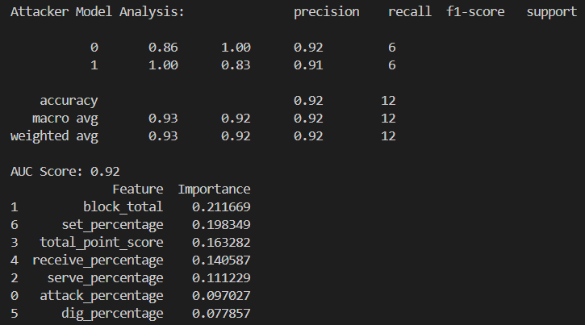

# Volleyball League Data Scraping & Analytics System

  

Top Volleyball League (TVL) is one of the highest level volleyball league in Taiwan. Starting from 2004, it has successfully promoted the sport and increasingly attracted more spectators. This project aims to provide players' insights the in the league and offer recommendation for the Chinese Taipei Volleyball Association or other stakeholders, such as overseas team managers. It identifies potential national team candidates and highlights talented players suitable for recruitment as valuable assets.

This project is a personal side project developed using modern technology stacks and methodologies, including **FastAPI** for API development, **Celery** and **RabbitMQ** for asynchronous task management, and Docker for efficient deployment. The data is sourced from TVL's publicly available datasets, covering the seasons from tournament 13 to 20. Moreover, it employer machine learning (ML) techniques to analyze player performance and predict potential outcomes, while Tableau Public provides visual analytics for data interpretation.

## Project Overview

The Volleyball League Data Scraper consists of two main modules:

- API: Built with FastAPI, handles database interactions and provides endpoints to access scraped data.
- Crawler: Performs web scraping tasks, extracting data from public volleyball league websites.
- ML models: Predicts player performance
- Tableau: Visualizing data

### Architecture Diagram


### API Documentation

The FastAPI-based web service is live and available for testing or integration at:

http://173.255.238.69:8888/docs

### Tableau Dashboard Overview


https://public.tableau.com/app/profile/chen.han.hsieh/viz/2_17505645639340/City

### Machine Learning Performance

This project includes two attacker classification models—Men's Division and Women's Division—which are trained to predict whether a player is a suitable candidate for the national team based on match statistics.

| Division         | Accuracy | AUC Score | Precision                      | Recall    | F1-score  |
| ---------------- | -------- | --------- | ------------------------------ | --------- | --------- |
| Men's Division   | 0.88     | 0.94      | 0.90 (class 0), 0.86 (class 1) | See chart | See chart |
| Women's Division | 0.92     | 0.92      | 0.86 (class 0), 1.00 (class 1) | See chart | See chart |

Detailed model testing results:




.png)

.png)

Each model was trained using features extracted from real match data such as:

- block_total
- set_percentage
- total_point_score
- attack_percentage
- dig_percentage
- serve_percentage
- receive_percentage

Based on the trained attacker models, we predicted the top potential candidates for the national team from the Taiwan Top Volleyball League. The selection excludes existing national players and focuses on high-impact attackers with strong metrics.

The final prediction results are available in:

- [`top10_potential_nat_attacker_men.csv`](ml/recommendation_result/top10_potential_nat_attacker_men.csv)
- [`top10_potential_nat_attacker_women.csv`](ml/recommendation_result/top10_potential_nat_attacker_women.csv)

## Tech Stack

- **pyenv** & **Poetry**: Python environment and dependency management
- **Python**: BeautifulSoup, requests, pandas, sqlalchemy, pydantic ...
- **MySQL**: Structured data storage
- **Celery** & **RabbitMQ**: Distributed scraping tasks
- **Docker** & **Docker Swarm** Containerization and orchestration
- **Portainer**: Managing Docker Swarm
- **pytest** & **coverage**: Unit testing
- **Github**: Original version control and code management
- **GitLab**: Continuous integration and deployment (CI/CD)
- **Tableau Public**: Data visualization

## Directory Structure

```
Volleyball-League-Data-Scraping-Analytics-System
├── api
│   ├── main.py                 # API entry point
│   └── Dockerfile              # Docker configurations for api
├── volleyballdata
│   ├── crawler                 # Web scraping scripts
│   ├── database                # Database setup and interactions
│   ├── etl
│   │   └── etl.py              # Data ETL processes
|   ├── schema                  # Data format verifications
|   ├── tasks                   # Asynchronous task management
│   └── sql
│       └── CreateTableRaw.sql  # SQL code for creating tables for data scraping
├── ml
│   ├── data_prepare
│   │   └── prepare.py          # ML data preparation
│   ├── model                   # ML models
|   ├── training                # ML models training scripts
|   └── recommendation.py       # Main prediction scripts
├── bi
│   └── radar.py                # BI data preparation for radar chart
├── ETL_files                   # Output files from ETL processes
├── tests                       # Test cases
├── Dockerfile                  # Docker configurations for crawler
├── api.yml                     # Docker compose file for api
├── crawler.yml                 # Docker compose file for crawler
├── mysql.yml                   # Docker compose file for database
├── portainer.yml               # Docker compose file for portainer
├── produce.py                  # Asynchronously sends tasks to different queues
└── README.md                   # Project documentation
```

## Installation

### Quickstart (Recommended)

If you're starting fresh and want everything set up with one command (project, environment, services, database, swarm, etc.), just run:

```bash
make setup-all
```

This command will:

- Clone the GitLab repository
- Install Python 3.9.21 via pyenv and set up dependencies using poetry
- Generate environment variables
- Initialize Docker Swarm
- Deploy crawler and API using prebuilt Docker Hub images (v7.2.1 and v7.2.2)
- Deploy MySQL, RabbitMQ, and Portainer

### Manual Setup (Advanced or Custom Deployment)

1. Clone and set up Python environment

```bash
make initiate-project
```

2. Generate development environment variables

```bash
make gen-dev-env-variables
```

3. Initialize Docker Swarm

```bash
make initiate-swarm
```

4. Deploy backend services

First-time only (uses fixed versions)

```bash
make first-deploy-crawler
make first-deploy-api
```

For newer Git tag–based deployments (after tagging and pushing images)

```bash
make deploy-crawler
make deploy-api
```

5. Deploy supporting services

```bash
make deploy-mysql
make deploy-rabbitmq
make deploy-portainer
make deploy-api
```

## Portainer Swarm Label Configuration

After deploying all services using Docker Swarm, you need to configure node labels in Portainer to ensure each service is scheduled to the correct node.

1. Open Portainer Web UI
2. Click on Swarm → Nodes
3. Click on your active node (e.g., localhost or your IP address)
4. Scroll down to the Node Labels section
5. Add the following labels (as shown in the screenshots):

| name     | value |
| -------- | ----- |
| api      | true  |
| crawler  | true  |
| flower   | true  |
| mysql    | true  |
| rabbitmq | true  |


Docker Swarm uses node constraints to determine where to deploy a service. Your docker-compose / stack files use label-based placement rules like:

```bash
placement:
  constraints: [node.labels.api == true]
```

If you don’t assign these labels in Portainer, your services will not start properly because Swarm won’t find eligible nodes.

## Database Setup

- The database **volleyballdb** must be created manually in phpMyAdmin or your database interface of choice
- Make sure to set the collation to **utf8mb3_unicode_ci** to ensure proper handling of multilingual text data
- Once the database is created, you can generate all required tables by executing the SQL script located at:

```bash
volleyballdata/sql/CreateTableRaw.sql
```

This script defines the full schema required to store volleyball match data, and includes the following tables:
| Table Name      | Description                                                                                                                    |
| --------------- | ------------------------------------------------------------------------------------------------------------------------------ |
| `Matches`       | Stores metadata for each match including date, arena, and match type. Acts as the central table for foreign key relationships. |
| `Match_Score`   | Stores the scores per set for each team involved in a match. Linked to `Matches` by `match_cup_id`.                            |
| `Match_Referee` | Captures information about the referees assigned to each match.                                                                |
| `Match_Coach`   | Logs coaching staff (head and assistant coaches) per team per match.                                                           |
| `Player_Stats`  | Detailed player-level statistics per match, including attacks, blocks, serves, digs, sets, and total points.                   |

Each of the auxiliary tables (Match_Score, Match_Referee, Match_Coach, and Player_Stats) is linked to the Matches table using the foreign key match_cup_id, ensuring referential integrity.

The design follows a relational model where:

- Matches is the central entity
- All related data (score, staff, stats) is normalized into separate tables
- Data is cleanly structured for analytical processing, ETL, and visualization

To quickly get all the data without crawling, you can simply use the SQL files in: volleyballdata/sql/data

## ETL Output

Processed data is also saved to CSV files under the ETL_files/ directory, including:

- Match metadata
- Player and team statistics
- Cleaned and aggregated data for downstream use (e.g., ML, Tableau)

## Usage

### Machine Learning

Prepare data and train ML models:

```bash
poetry run python ml/data_prepare/prepare.py
poetry run python ml/training/train_attacker_men_model.py
poetry run python ml/training/train_attacker_women_model.py
```

Produce recommendation for potential national team players

```bash
poetry run python ml/recommendation.py
```

### Business Intelligence

Generate data for Tableau:

```bash
poetry run python bi/radar.py
```

## Testing

Execute tests using pytest and check coverage:

```bash
make test-coverage
```

## Additional Insights

### Player Win Rate Table

You can generate player-specific win rate statistics using the SQL query provided in:

```bash
volleyballdata/sql/Player_WinRate.sql
```

This view aggregates each player's performance based on match outcomes and provides a percentage-based win rate. It’s useful for evaluating individual impact in competitive settings.

### ML Candidate Metadata

Additional player information is stored in:

```bash
ETL_files/Players.csv
```

This file includes:

- Selected Taiwan Top Volleyball League (TVL) players
- Manually curated national team athletes sourced from Wikipedia and official announcements
- Useful for ML candidate filtering, labeling, and as a ground truth base for evaluation

## Contributing

Contributions are welcome!

1. Fork the repository.
2. Create a new branch:

```bash
git checkout -b feature-yourfeature
```

3. Commit your changes and push the branch:

```bash
git commit -m "Your descriptive commit message"
git push origin feature-yourfeature
```

4. Open a pull request.

## Acknowledgements

This project was inspired by the technical structure and best practices outlined in the book  
**《Python 大數據專案 X 工程 X 產品：資料工程師的升級攻略（第二版）》**  
(ISBN: 9789864347527) [Books.com.tw](https://www.books.com.tw/products/0010964744) 
by Sam Lin [linsamtw](https://github.com/linsamtw)

Huge shout out to Sam!

While I followed the overall approach in the book to build a robust ETL + API + CI/CD pipeline using tools like FastAPI, Docker Swarm, and Celery,  
**all domain-specific data, use case design, feature engineering, and model logic were self-developed and focused on Taiwan's Top Volleyball League.**

This project extends beyond the book with real-world public sports data, Tableau dashboards, and national team prediction modeling.

## License

This project is licensed under the [GNU General Public License v3.0](LICENSE)